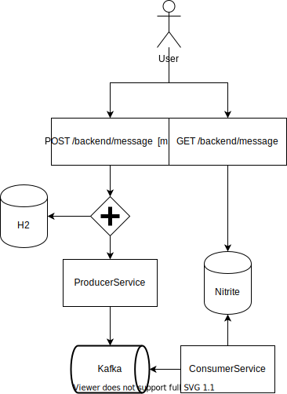

# CQRS Example

This is my first application based on CQRS architecture. The example is focused on add and retrieve messages.

## Technologies

* Spring boot (2.3.0)
* H2 database (1.4.200)
* Nitrite Database (3.4.1)
* Apache Kafka (2.5.0)

## Architecture



## Configuring Kafka

* First, install and run [Apache Kafka](https://kafka.apache.org/)

```
# init zookeeper
bin/zookeeper-server-start.sh config/zookeeper.properties

# Then init kafka
bin/kafka-server-start.sh config/server.properties
```

*Testing Kafka Consumer:*

    $KAFKA_HOME/bin/kafka-console-consumer.sh --bootstrap-server localhost:9092 --topic test --group group_id

*Testing Kafka Provider:*

    $KAFKA_HOME/bin/kafka-console-producer.sh --bootstrap-server localhost:9092 --topic test

## Testing Example

#### POST Method

    curl -X POST -F 'message=String' http://localhost:8080/backend/message

#### GET Method
    curl -X GET http://localhost:8080/backend/message

